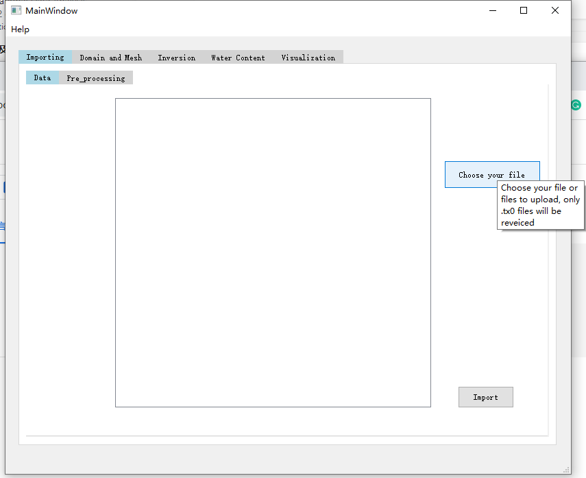
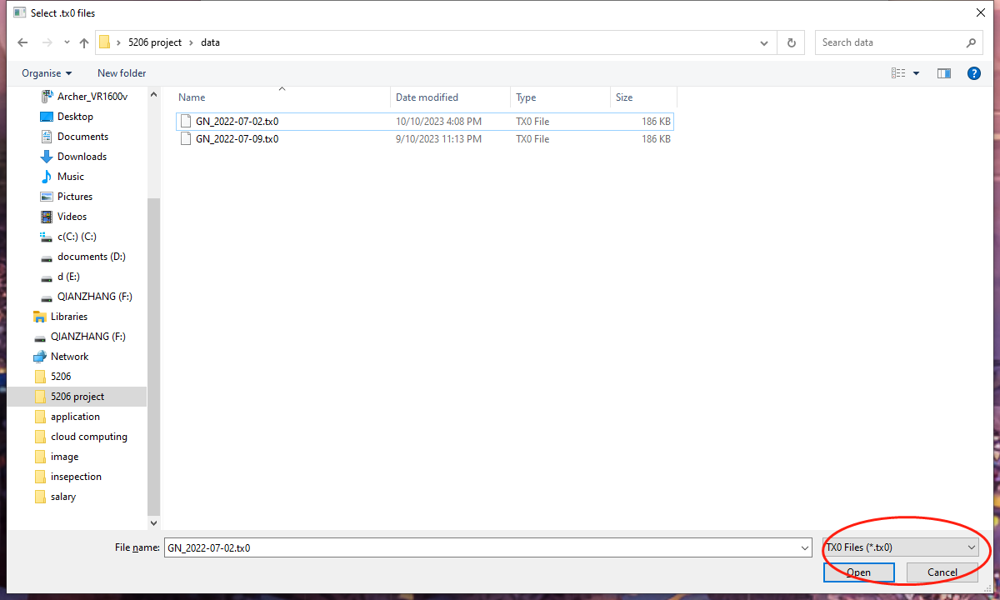
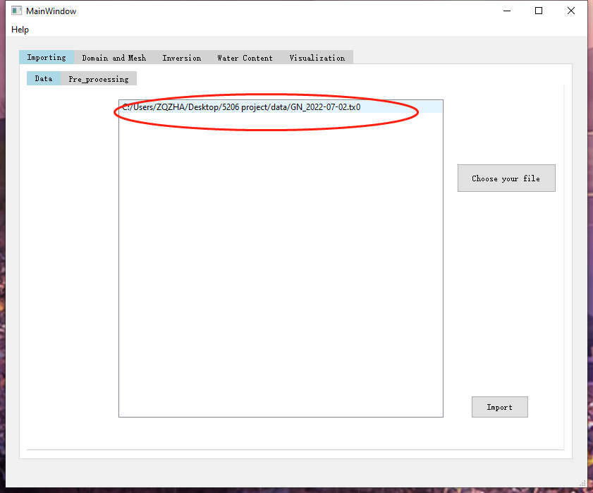
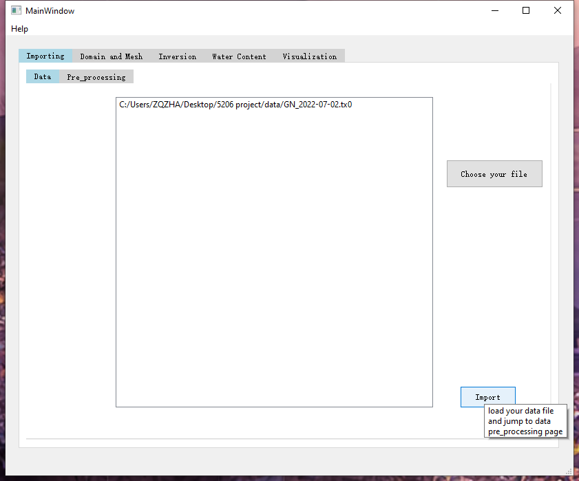
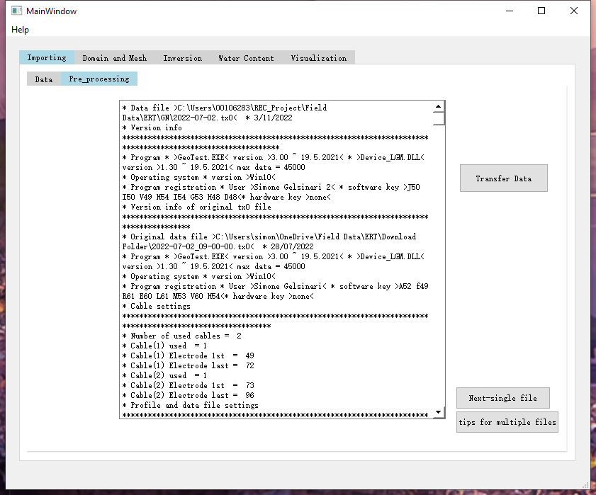
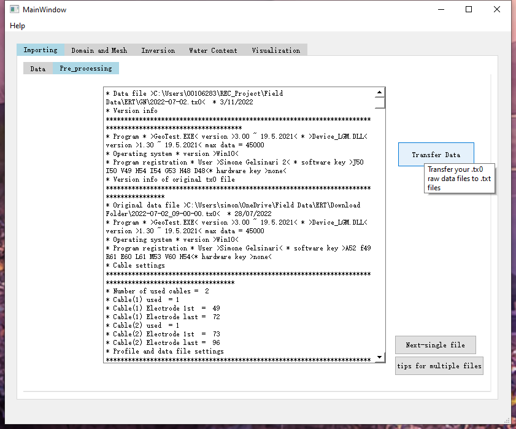
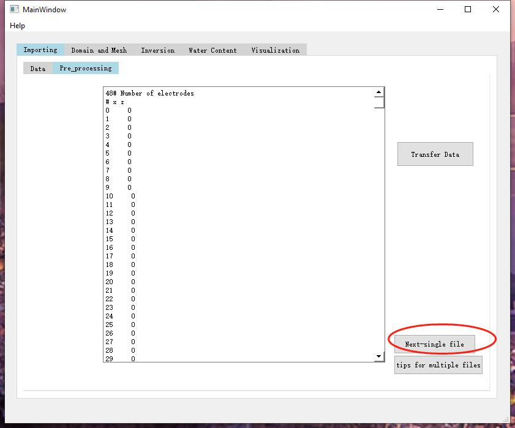
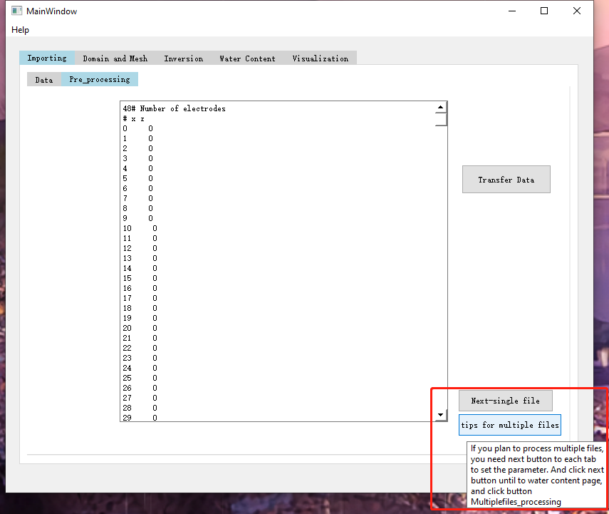

# Data Preprocessing

This window in this PyQt5-based application allows users to upload and save single and multiple files. Users can save their data files in specific file folders. Users can also see the details of the data files uploaded. This part can allow users to transfer raw data to calculated data. This readme provides an overview of the Data Preprocessing window and its functionalities.

## Functions

### Data File upload and save

**1. File upload**

Click the button 'Choose your file', and the upload files window will jump out and ask users to select files on their computer. 
Please note: only tx0 files and directories will be identified. Users can also upload files many times(can be from different locations), but the same files can't be uploaded twice.

**2. File save** 

After users select files to upload, another window will jump out to ask them to choose a file folder to save. Normally, users are recommended to save files to a data folder(better to be different from the uploading directory).

**3. File list ** 

After users save the file, the file list will be shown.

### Import and transfer data

**1. Import**

Users can click the button 'Import', the application will jump to the Pre_processing page, and the file's content will be shown in the text browser.

**2. Transfer data**

Users can click the 'Transfer data' button to transfer raw data to calculated data.

### Connect to other pages

There are a button called 'Next-single file'. Users can click it and jump to part 'domain and mesh'. 

'Next-single file' will allow users to start step-by-step data processing.

## Additional Notes

Users cannot upload files that have been uploaded. 

Time-lapse video needs users to upload continuous data files. Otherwise, a time-lapse video makes no sense.

